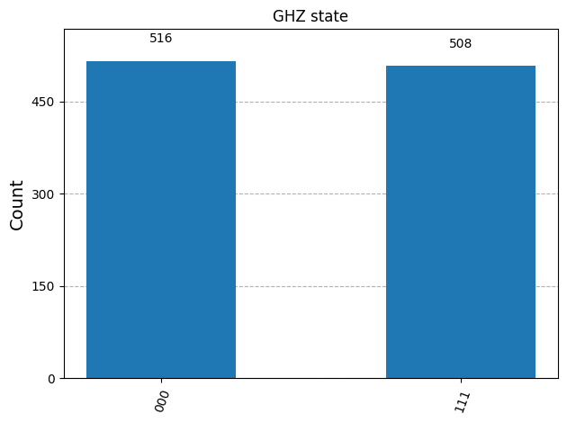
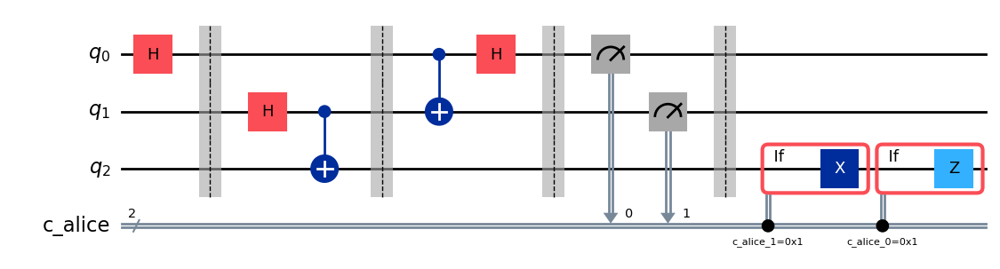
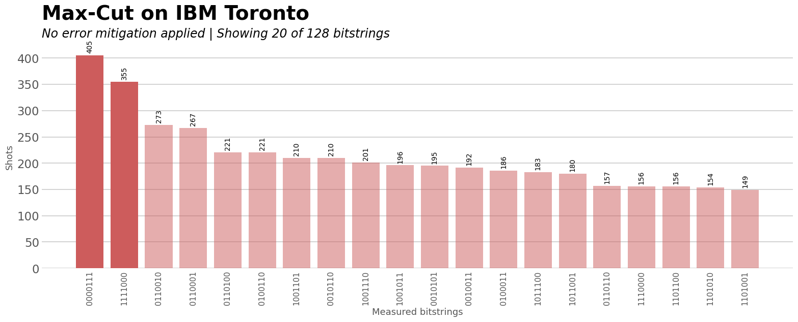
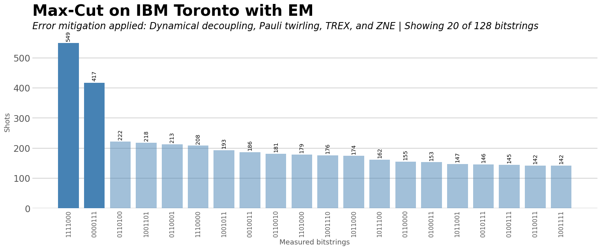
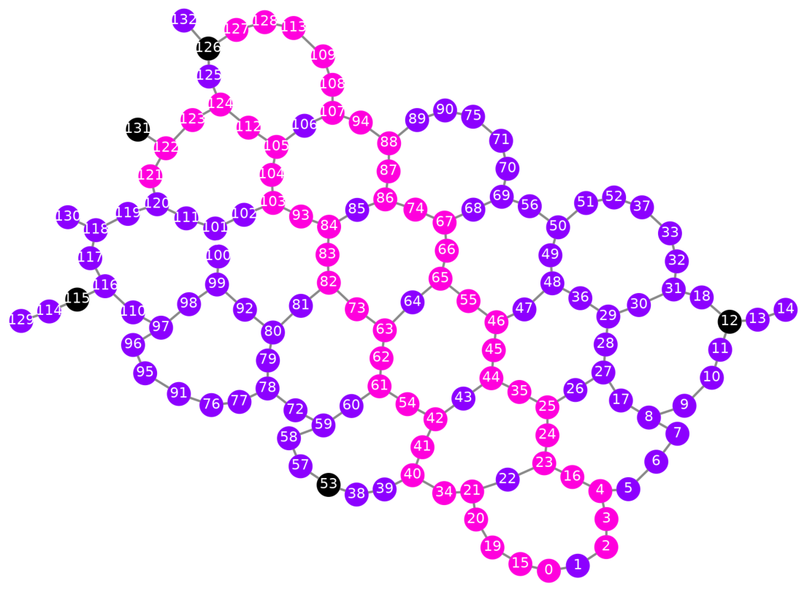
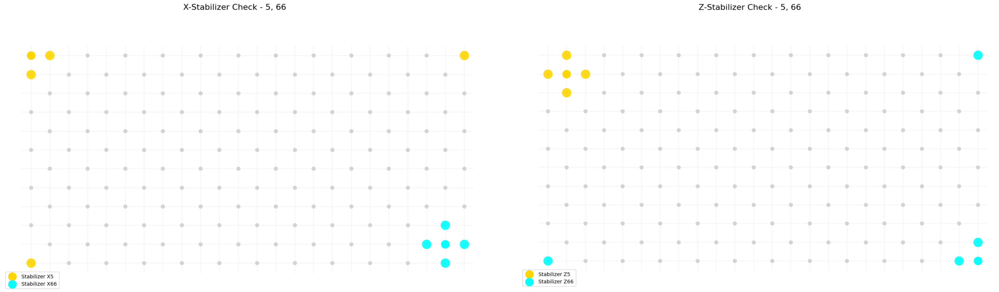

# Qiskit Global Summer School: The Past, Present and Future of Quantum Computing

This repository contains the completed labs from the 2025 edition of the **Qiskit Global Summer School**, focused on the foundational and modern techniques of quantum computing for simulating physical systems. Each lab explores a progressively advanced concept in quantum physics using Qiskit and Python, merging theory and practical implementation.

## Environment Setup

To reproduce the results and run the notebooks in a controlled environment, use the provided Conda environment:

```bash
conda env create -f qiskit.yml
conda activate qiskit
````

## Lab Overview


### 📁 `lab0` — Hello Quantum World! Building a GHZ Circuit

This lab serves as an introduction to working with Qiskit, IBM Quantum hardware, and fundamental quantum circuit patterns. It walks through the entire lifecycle of a quantum program using the **GHZ state** as a case study.


* **Environment Setup:**

  * Installation of Qiskit and dependency resolution.
  * Configuration of the IBM Quantum account using an API token.
  * Sanity checks to verify access to backends and simulators.

* **Quantum Circuit Construction:**

  * **Target state:** The three-qubit GHZ state

    $$
    \frac{1}{\sqrt{2}} \left( \lvert 000 \rangle + \lvert 111 \rangle \right)
    $$
  * Use of Qiskit patterns: `map → optimize → execute → post-process`.

* **Step 1 — Map:**

  * Explicit construction of the GHZ circuit using Hadamard and CNOT gates.
  * Logical-to-physical qubit mapping.

* **Step 2 — Optimize:**

  * Application of transpilation to optimize the circuit for selected hardware or simulator.
  * Consideration of gate depth and connectivity constraints.

* **Step 3 — Execute:**

  * Execution of the quantum job on a simulator backend (`qasm_simulator`) or real hardware.
  * Handling job queues and real device latency.

* **Step 4 — Post-process:**

  * Histogram analysis of the measurement results using `matplotlib`.
  * Verification of the expected entanglement pattern (only `000` and `111` observed with \~50% each).

* **Bonus Challenge:**

  * Instructions and motivation to run the GHZ circuit on a real quantum device (e.g. `ibmq_belem`, `ibmq_lima`).
  * Explanation of the influence of decoherence and gate noise on GHZ fidelity.



---

### 📁 `lab1` — Recreating Famous Experiments at Home: Superposition, Entanglement, and Teleportation

This lab reconstructs quantum experiments using Qiskit to illustrate fundamental concepts in quantum mechanics, including **superposition**, **interference**, **measurement**, **entanglement**, and **quantum teleportation**. These are explored both conceptually and through simulation and circuit implementation.

#### 1. Superposition, Interference, and Measurement

* **Double-slit Experiment (Quantum version):**

  * Simulation of the quantum double-slit experiment using Qiskit circuits.
  * Analysis of probability amplitudes and interference terms.
  * Demonstration of how measurement collapses superposed states and alters the interference pattern.

* **Schrödinger\'s Cat Analogy:**

  * Implementation of cat-like superposition states.
  * Visual representation of quantum measurement collapse via circuit-based interference.

* **Double-slit with Measurement:**

  * A variation introducing mid-circuit measurement and its destructive effect on coherence and interference.

#### 2. Entanglement

* **CHSH Game — Quantum Advantage in Bell-Type Inequalities:**

  * Construction of a classical vs. quantum strategy using entangled states.
  * Implementation of the CHSH game via parameterized circuits in Qiskit.
  * Computation of success probabilities and demonstration of violation of classical limits (75%).

* **Technical Details:**

  * Explicit generation of Bell states.
  * Parameterized gates for strategic measurement bases.
  * Batched simulations over all input combinations with result aggregation.

* **Results:**

  * Quantum strategy achieves \~85% success rate, beating the classical bound.

---

#### 3. Quantum Teleportation

* **Step-by-step protocol:**

  * State preparation of arbitrary single-qubit states.
  * Construction of Bell pair (entangled ancillas).
  * Application of CNOT and Hadamard gates.
  * Conditional Pauli corrections based on classical outcomes.

* **Circuit-level Implementation:**

  * Usage of Qiskit dynamic circuits for conditional operations.
  * Simulation of the protocol and fidelity checks to ensure teleportation worked.

* **Interpretation of results:**

  * Visualization of Bloch vector before and after teleportation.
  * Fidelity close to 1 for simulator runs, confirming accurate quantum information transfer.




---

### 📁 `lab2` — Cutting Through the Noise: Executing Quantum Algorithms on Noisy Devices

This lab tackles the core challenge of current quantum computing: **quantum noise**. Through the concrete example of solving a small instance of the **Max-Cut problem**, the lab provides a complete methodology to mitigate errors and optimize circuits for execution on noisy quantum hardware.


#### 1. Introduction to Quantum Noise

* **Theoretical foundations**:

  * Description of quantum noise as a result of decoherence, gate errors, and measurement errors.
  * Characterization of device properties such as $T_1$, $T_2$, readout errors, and gate fidelities.

* **Practical Exercise**:

  * Extraction of device calibration data from IBM Quantum backends.
  * Identification of optimal qubits and gate paths.

#### 2. Solving the Max-Cut Problem with QAOA

* **Problem mapping**:

  * Conversion of a weighted undirected graph into an Ising Hamiltonian.
  * Representation of graph cuts as bitstring partitions.

* **Quantum Approximate Optimization Algorithm (QAOA)**:

  * Construction of cost and mixer operators.
  * Variational optimization over angle parameters $(\gamma, \beta)$.
  * Measurement and statistical analysis of output bitstrings.

#### 3. Simulating Noise and Error Characterization

* **Backend configuration**:

  * Use of noisy simulators to emulate real device behavior.
  * Error counting for gates and readouts.

* **Error estimation**:

  * Introduction of NEAT (Noise Estimation And Tracking) tools.
  * Use of noise models to inform optimization strategies.

#### 4. Transpilation Techniques

* **Circuit optimization**:

  * Minimization of two-qubit gate count (e.g., CNOT depth).
  * Selection of optimal qubit mappings via transpiler stages.

* **Layout search**:

  * Enumeration and scoring of all valid mappings.
  * Automatic selection of the lowest-error physical layout.

#### 5. Error Mitigation Techniques (EM)

* **Zero Noise Extrapolation (ZNE)**:

  * Implementation of **global** and **local folding** strategies to artificially amplify noise.
  * Extrapolation of ideal (zero-noise) expectation values using polynomial regression.

* **Technical details**:

  * Manual gate repetition for noise amplification.
  * Use of `mitiq` or manual circuit manipulation in Qiskit.

#### Bonus Challenge: Executing on Real Quantum Hardware

* **Final pipeline**:

  * Full application of noise-aware transpilation and mitigation techniques.
  * Execution of QAOA circuits on IBM hardware.
  * Post-processing and visualization of performance vs simulation.

* **Validation**:

  * Use of estimators to compare real and ideal outcomes.
  * Generation of visual reports with matplotlib and seaborn.

#### Concepts Reinforced

* Practical understanding of noise models and mitigation in NISQ devices.
* Hands-on deployment of VQAs like QAOA under realistic hardware constraints.
* Combination of optimization, physics, and engineering in quantum workflows.
* Introduction to advanced transpiler configuration and circuit fidelity estimation.

#### Results of the run on the IBM Toronto Quantum Computer




---

### 📁 `lab3` — Quantum Chemistry and Sample-Based Quantum Diagonalization (SQD)

This lab explores the quantum simulation of molecular systems, with a focus on **sample-based quantum diagonalization (SQD)**, a state-of-the-art technique in quantum chemistry. The lab walks through the full simulation pipeline for molecules such as O$_2$ and N$_2$, incorporating **VQE**, **basis set construction**, and **ansatz engineering**.


#### 1. From Atoms to Hamiltonians

* **Overview of quantum chemistry:**

  * Introduction to atoms and molecular structure.
  * Review of the time-independent Schrödinger equation in the context of many-body molecular systems.
  * Use of second quantization and qubit mappings for molecular Hamiltonians.

* **Basis Set Approximation:**

  * Discussion of common basis sets (e.g., STO-3G, 6-31G) and their trade-offs.
  * Encoding of molecular orbitals and electronic interactions into a qubit Hamiltonian.

* **Exercise 1:**

  * Computation of the number of terms in the Hamiltonian of O$_2$.
  * Complexity scaling with basis set size and number of electrons.

---

#### 2. Variational Quantum Eigensolver (VQE)

* **Concept:**

  * Hybrid quantum-classical algorithm to estimate ground state energies.
  * Use of parameterized ansätze such as UCC or LUCJ.
  * Measurement of expectation values and classical optimization loop.

* **Implementation:**

  * Use of Qiskit’s VQE routines and `Estimator` primitives.
  * Analysis of convergence behavior and fidelity.

---

#### 3. Sample-Based Quantum Diagonalization (SQD)

* **Innovation:**

  * Decomposes the Hamiltonian into a set of sampled configurations.
  * Reduces measurement overhead by targeting informative subspaces.

* **Configuration Recovery:**

  * Iterative loop to refine and recover high-fidelity configurations.
  * Use of classical post-processing to reconstruct energies from subspace diagonalization.

* **Noise-resilience:**

  * SQD shown to perform robustly even under realistic noise models.

---

#### 4. Case Study: N$_2$ Molecule Simulation

* **Complete SQD Pipeline:**

  * Build molecular Hamiltonian with Qiskit Nature.
  * Choose relevant basis and LUCJ ansatz.
  * Execute SQD protocol across recovery and diagonalization loops.
  * Map → Optimize → Execute → Post-process (Qiskit Patterns).

* **Visualization:**

  * Graphical analysis of the reconstructed energy spectrum.
  * Comparison between noisy and ideal estimates.

---

#### 5. Improving the Ansatz

* **Basis and Layout Tuning:**

  * Exercise 3: Evaluate different basis sets and their effect on accuracy and resource demands.
  * Exercise 4: Optimize qubit layout to minimize noise.
  * Exercise 5: Engineer the ansatz to increase expressivity (e.g., adding interaction terms to LUCJ).

---

#### Bonus: Real Hardware Execution with Error Mitigation

* Execution of the SQD pipeline on real IBM hardware.
* Application of transpilation and layout optimization.
* Use of error mitigation techniques to recover meaningful results.

#### Concepts Reinforced

* Application of quantum computing to electronic structure problems.
* Deep understanding of VQE and its limitations.
* Introduction to advanced techniques like SQD for Hamiltonian diagonalization.
* Quantum circuit engineering for chemical accuracy.




---

### 📁 `lab4` — Quantum Error Correction: From Core Concepts to the Road to Fault-Tolerant Quantum Computing

This lab introduces the theoretical and computational framework of **quantum error correction (QEC)** — a cornerstone of scalable, fault-tolerant quantum computation. It starts with classical error correction codes and builds up to advanced quantum codes such as the **Toric Code**, **Gross Code**, and **Quantum LDPC** (QLDPC) codes.

#### 1. Classical Error-Correcting Code Revisit

* **\[n, k, d] codes**:

  * Introduction to linear block codes.
  * Definitions: code length $n$, message length $k$, and code distance $d$.

* **Hamming distance and minimum distance**:

  * Discussion of error detection and correction capacity.

* **Repetition Code \[3,1,3]**:

  * Encoding and decoding logic.
  * **Practice**: Construction of a decoder via lookup tables for bit-flip correction.

---

#### 2. Quantum Error Correcting Codes \[\[n, k, d]]

* **Stabilizer Formalism**:

  * Pauli group operators, stabilizer generators, and syndrome extraction.
  * Quantum codewords as simultaneous +1 eigenstates of stabilizers.

* **3-Qubit Bit Flip Code**:

  * Encoding a logical qubit using repetition.
  * Circuit-based simulation and detection of single-qubit bit-flips.

* **CSS Codes (Calderbank-Shor-Steane)**:

  * Dual classical codes embedded into quantum codes.
  * **Steane \[\[7,1,3]] code**:

    * Generator matrices, stabilizers, logical operators.
    * Weight enumeration: detection of 1-, 2-, and 3-qubit errors.

* **Exercises**:

  * Syndrome decoding with lookup tables.
  * Analysis of parity-check matrices and error weights.

---

#### 3. Advanced QEC Architectures

* **Quantum LDPC (QLDPC)**:

  * Overview of sparse stabilizer matrices enabling scalability.
  * Discussion of decoders and complexity trade-offs.

* **Toric Code**:

  * Topological code on a 2D lattice with periodic boundary conditions.
  * **Exercise 4**: Derive $H_X$, $H_Z$ parity-check matrices.
  * Implementation of stabilizers using graph-based representation.

* **Gross Code**:

  * Generalization of topological codes with tailored connectivity.
  * **Exercise 5**: Build and analyze $H_X$, $H_Z$ matrices.

* **Counting Logical Qubits**:

  * **Exercise 6**: Compute the number of encoded logical qubits via:

    $$
    k = n - \text{rank}(H_X) - \text{rank}(H_Z)
    $$

* **Connectivity and Layout**:

  * Role of qubit connectivity in hardware-efficient QEC realization.

#### Concepts Reinforced

* Comparison between classical and quantum redundancy.
* Stabilizer code construction and syndrome-based decoding.
* Trade-offs between code distance, overhead, and fault-tolerance.
* QEC as a tool toward scalable, fault-tolerant quantum computation.



---

## Acknowledgements

These labs were completed as part of the [Qiskit Global Summer School](https://www.ibm.com/quantum/blog/qiskit-summer-school-2025), organized by IBM Quantum.

---

## License

This repository follows the license conditions defined by IBM Quantum for educational materials. Please refer to individual notebooks for source credits when applicable.

